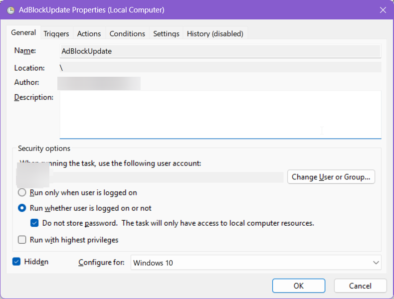

<div align="center">

# HostlistDownloader

A basic utility for Windows and Linux designed for users to download multiple host files from remote URLs, remove empty lines and comments, and consolidate them into a single combined blocklist/whitelist file. Perfect for services like Portmaster.

[](https://github.com/lloyd99901/HostlistDownloader/issues)
[](https://github.com/lloyd99901/HostlistDownloader/stargazers)
[](/LICENSE)

<br/>
<div align="left">

## Core Capabilities

HostlistDownloader streamlines hostlists by automatically fetching lists from remote sources that the user configures and merging them into one combined-blocklist/whitelist txt file.

| Feature | Description |
| :--- | :--- |
| **Automated Data Fetching** | Downloads raw host files directly from all configured URLs defined within the `settings.json` file. |
| **Smart Update Checking** | Checks for updates using HTTP eTags to ensure only fresh versions of host files are downloaded, saving bandwidth and time. |
| **Multi-Threaded Downloads** | Utilizes customizable multi-threaded downloading to process and fetch numerous hostfiles quickly. |
| **Data Cleaning & Merging** | Automatically strips out empty lines, comments (`#`, `;`), and detects/removes duplicate entries during consolidation. |
| **Format Flexibility** | Forces a specific output format on all downloaded files (e.g., `hosts` file standard, IP-only, domain list, DNSMasq). |
| **Customization** | Allows combining pre-existing user-defined blocklists or whitelists with the automatically downloaded lists. |

## How to Configure

The primary configuration method involves defining your source URLs and required parameters in the `settings.json` file. This centralized system ensures clear management of all input sources, whether they are general blocklists, specific whitelists, or custom user domains.

1. **Initial Run:** Run HostlistDownloader once. This process will create a default, template `settings.json` file for you.
2. **Editing Settings:** Open and edit the `settings.json`. Add or modify the desired URLs of your host lists (separate multiple URLs with new lines). You can also adjust global settings like format type, maximum download threads, or log expiry period.
3. **Execution:** Run HostlistDownloader again. It will automatically detect the new sources, download the updated host lists, and generate the final combined output file (`HLDcombined-...txt`), fully cleaned of duplicates and comments.

### Running Scheduled Tasks (Silent Operation):
To configure a task schedule to run silently, set up the task using the following settings: "Run whether user is logged on or not," "Do not store password," and "Hidden." The next time this scheduled task runs, it will execute without any visible prompts and will save the last run's results. **Any result code other than `0x0` indicates a problem occurred.**



### File Structure Overview

| Path / Filename | Functionality |
| :--- | :--- |
| [`settings.json`](#) | **Configuration:** Contains all runtime settings and the crucial URLs to remote hostfile lists for blocking/whitelisting. |
| [`hostfiles/combined/HLDcombined-blocklist.txt`](#)     | **Output**: The consolidated list containing all processed blocklist entries merged locally. |
| [`hostfiles/combined/HLDcombined-whitelist.txt`](#)     | **Output**: The consolidated list containing all processed whitelist entries merged locally. |
| [`hostfiles/combined/HLDcombined-list.txt`](#)     | **Output**: A combined file where blocklist entries that are explicitly present in the whitelist have been removed (Useful for filters requiring a single input). |
| [`hostfiles/blocklist/*`](#)     | **Host list storage**: Stores individual, downloaded host files and associated etags. |
| [`hostfiles/whitelist/*`](#)     | **Host list storage**: Stores individual, downloaded whitelist files and associated etags. |

### Example `settings.json`

```json
{
  "blocklists": [
    "https://cdn.jsdelivr.net/gh/hagezi/dns-blocklists@latest/wildcard/ultimate-onlydomains.txt",
    "https://raw.githubusercontent.com/StevenBlack/hosts/master/hosts",
    "https://someonewhocares.org/hosts/zero/hosts",
  ],
  "whitelist": [],
  "formattype": "domain",
  "userWebsiteBlocklist": [],
  "userWebsiteWhitelist": [],
  "maxDownloadThreads": 3,
  "logExpiryInDays": 7
}
```

"formattype" Accepted Values: domain, host, iponly, dnsmasq (output: address=/hostnamehere/0.0.0.0), wildcard (output: *.hostnamehere)

### Run result codes (Error codes)

If you encounter an error code, please first check the detailed log generated by HostlistDownloader on the day of the failure. If errors like 0x28 or 0x2A occur, try running the utility with the /fr argument; this will clean up the entire directory structure while retaining your settings.json.

| Run result code | Meaning |
| :--- | :--- |
| **[0x0] (0)** | **Success:** The process ran without issues. The combined list was successfully updated, or no updates were available for the configured sources. |
| **[0x1] (1)** | General error occurred. This indicates a non-specific issue during operation that requires review of the detailed log file.|
| **[0x2] (2)** | Network connection failed. Could not establish a necessary network connection to complete the required downloads/tasks.|
| **[0xA] (10)** | Directory creation failed. Check if HostlistDownloader has permission to write files in its current directory, or ensure that security software (like ransomware protection) is not blocking folder access.|
| **[0x14] (20)** | Configuration file missing. The critical `settings.json` file was not found or accessible.|
| **[0x15] (21)** | Configuration file corruption detected. The structure or content of the settings file is invalid and cannot be read properly.|
| **[0x16] (22)** | Invalid configuration entry detected. The `settings.json` was readable, but a specific key or value contained within it could not be understood or used correctly. (E.g., misspellings in required keys.) |
| **[0x28] (40)** | Error during update process. A failure occurred when attempting the full host file update operation which affected all host file update attempts (e.g., network outage during batch update).|
| **[0x29] (41)** | Update completed with issues. The update process ran partially but some entries either failed to write, had download/multi-thread timeouts, or unexpected write errors.|
| **[0x2A] (42)** | Data validation check failed. An internal data integrity check was performed and detected that the output did not match the expected structure or standard. (Recommended to run /fresh argument if you get this error)|
| **[0x2B] (43)** | A multi-threaded task has reached a timeout threshold. The operation waited too long for a process to complete, suggesting resource exhaustion or connection stalling.|
| **[0x32] (50)** | Program executed from incorrect directory. HostlistDownloader must be run from its designated working directory for proper functionality and file management.|
| **[Other]** | Internal debugging error codes. These are reserved and indicate a rare, deep system failure.|